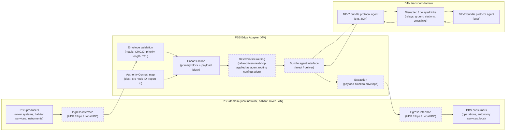
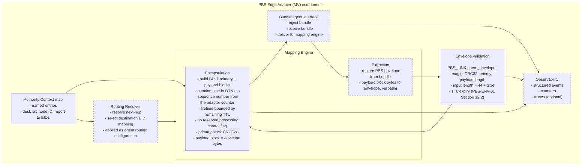
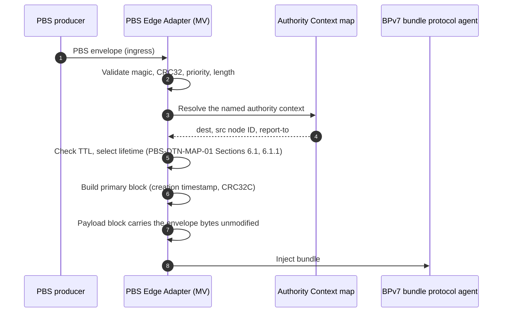
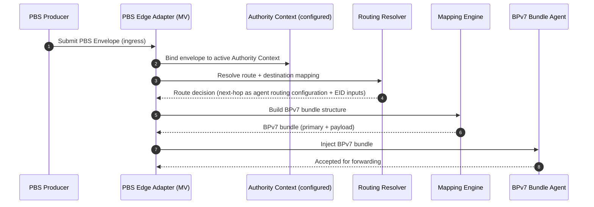
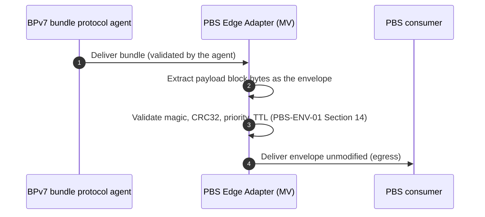
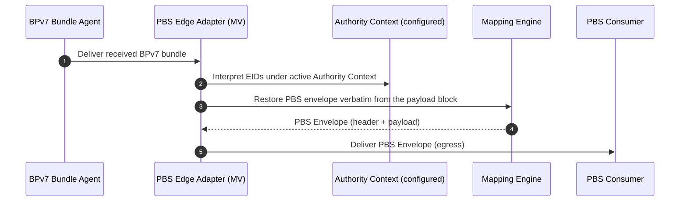
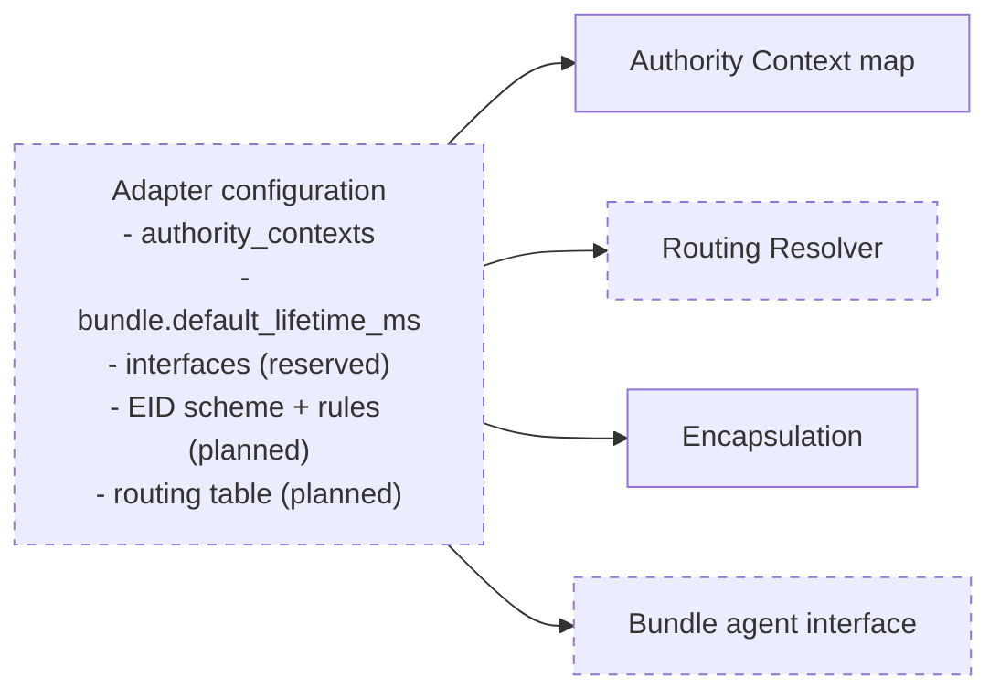
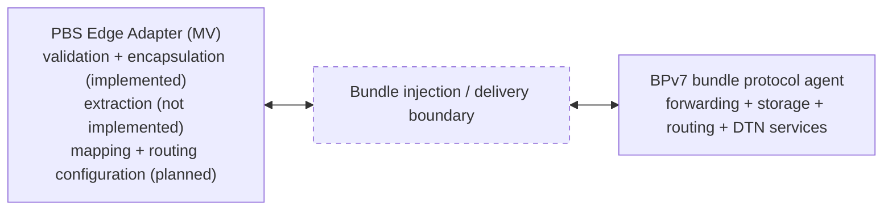

# PBS Edge Adapter — Architecture & Message Flows  
**Document ID:** PBS-EDGE-ARCHITECTURE  
**Status:** Reference Draft  
**Applies To:** PBS-EDGE-ADAPTER-MV  

---

## 1. Purpose

This document describes the reference architecture and message flows of the **PBS Edge Adapter (MV)**: its placement between PBS envelope producers and consumers and a BPv7 bundle protocol agent, its components, and the outbound and inbound flows.

Inside the PBS Edge Adapter, solid outlines mark components that `pbs_edge_adapter_worked_example.py` implements, and dashed outlines mark specified components that it does not implement. Adapter configuration is drawn dashed: the worked example has no configuration loader. PBS producers and consumers, bundle protocol agents and links are external systems.

---

## 2. Placement in a DTN Stack

The adapter sits between PBS-native systems, which emit and receive PBS-ENV-01 v1.3 envelopes, and a bundle protocol agent, which forwards BPv7 bundles. Routing, contact plans and convergence-layer selection remain in the agent (PBS-DTN-MAP-02 Section 8).

Pale Blue Systems is building the planned stages drawn dashed below. The ingress and egress interfaces use UDP, a pipe or local IPC. The deterministic routing stage resolves table-driven next-hop entries and applies them as configuration of the agent's routing; it does not override the agent's route computation (PBS-ROUTE-01 Section 6 permits gateway routing tables).

---

## 3. Functional Component Model

The Mapping Engine comprises encapsulation and extraction. The Routing Resolver is planned (in development); the adapter applies its next-hop result as configuration of the agent's routing, and route computation remains in the agent (PBS-DTN-MAP-02 Section 8).

| Component | Implementation in the worked example |
|-----------|--------------------------------------|
| Envelope validation | `PBS_LINK.parse_envelope`, the length check and `bundle_lifetime_ms` |
| Authority Context map | `AuthorityContextMap` |
| Encapsulation | `pbs_to_bpv7_bundle_mv`, `build_bpv7_bundle` |
| Extraction, Routing Resolver, bundle agent interface, observability | Not implemented |

---

## 4. Message Flow — Outbound (PBS to BPv7)

The flow begins when a PBS producer submits an envelope to the adapter ingress. Steps 2 to 7 are implemented in the worked example.

### Outbound Transformation Summary

- The Authority Context map supplies the destination EID, source node ID and report-to EID. No envelope field enters an EID.
- The bundle lifetime is the configured no-expiry lifetime for TTL 0 (PBS-DTN-MAP-01 Section 6.1.1; PBS-DTN-MAP-02 Section 4) and min(no-expiry lifetime, remaining TTL) otherwise (PBS-DTN-MAP-01 Section 6.1).
- The creation timestamp is the DTN time of the clock reading and a sequence number from the adapter's counter or the caller; no envelope field enters it (PBS-DTN-MAP-01 Section 6.1).
- No primary block field or processing control flag carries priority (PBS-DTN-MAP-01 Section 6.3).
- The complete envelope, 44-byte header and payload, becomes the payload block data. TTL and the header CRC32 are not modified (PBS-ENV-01 Sections 12.3 and 15).

### Planned Outbound Flow (in development)

Planned outbound transformation summary:

- PBS identifiers are interpreted under the active Authority Context.
- BPv7 Destination and Source EIDs are constructed deterministically.
- PBS envelope bytes (44-byte header and payload) become the BPv7 Payload Block bytes.

---

## 5. Message Flow — Inbound (BPv7 to PBS)

The flow begins when the bundle protocol agent delivers a bundle to the adapter. The worked example does not implement it.

### Inbound Transformation Summary

- The bundle protocol agent validates the bundle before PBS processing (PBS-DTN-MAP-01 Section 7.1).
- The payload block bytes are the original envelope, extracted verbatim (PBS-DTN-MAP-01 Section 7.2).
- No envelope field is derived from bundle EIDs.

### Planned Inbound Flow (in development)

Planned inbound transformation summary:

- BPv7 Source/Destination EIDs are parsed relative to the active Authority Context.
- Payload Block bytes become the PBS envelope bytes (44-byte header and payload), unmodified.
- The PBS envelope is restored verbatim (PBS-DTN-MAP-01 Section 7.2) and delivered to local consumers.

---

## 6. Configuration as an Architectural Boundary

Configuration defines the Authority Context map, the default bundle lifetime, and (in a later revision) the interface bindings. The `interfaces` key is reserved (Appendix B, Section B.7). [PBS-EDGE-CONFIG-SCHEMA](PBS-EDGE-CONFIG-SCHEMA.md) specifies the configuration. The worked example takes the equivalent values as Python arguments.

The planned configuration (in development) also defines:

- routing resolution tables for deterministic next-hop selection, applied as configuration of the bundle protocol agent's routing (PBS-DTN-MAP-02 Section 8; PBS-ROUTE-01 Section 6),
- ingress/egress interface endpoints.

---

## 7. Integration Boundary with the Bundle Protocol Agent

The adapter and the bundle protocol agent interact only through bundle injection and delivery. The agent provides forwarding, storage, routing and other DTN services.

Pale Blue Systems is building the routing stage of Section 2, which adds one interaction: the adapter supplies its routing table to the agent as routing configuration, and the agent's route computation is unchanged (PBS-DTN-MAP-02 Section 8).

---

## 8. Architecture Outputs

- PBS to BPv7 encapsulation per [PBS-BPv7-MAPPING-APPENDIX](PBS-BPv7-MAPPING-APPENDIX.md), implemented and tested in the worked example.
- BPv7 to PBS extraction per PBS-DTN-MAP-01 Section 7, specified and not implemented.
- Planned (in development): deterministic BPv7 → PBS restoration, verbatim, aligned with the Authority Context model.
- A placement model for DTN interoperability review.
