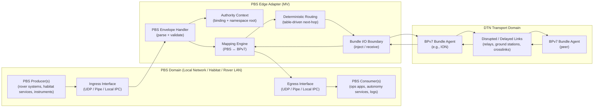
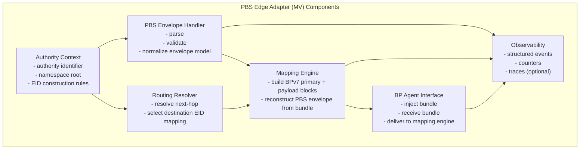
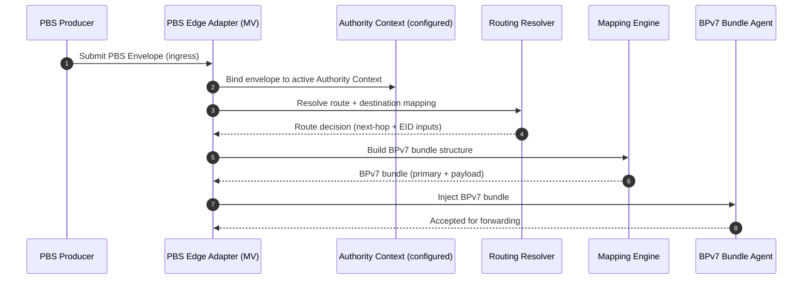
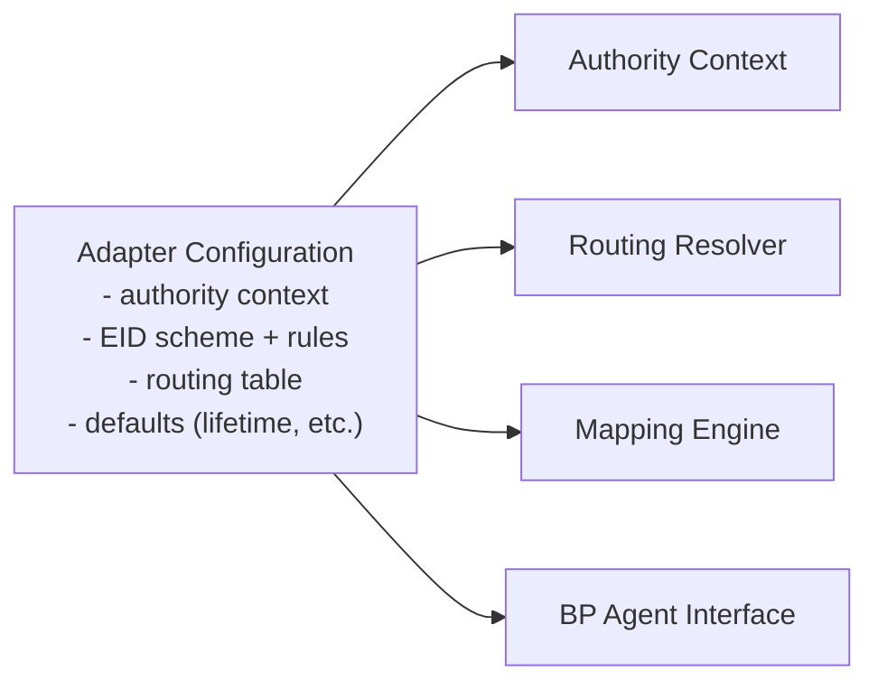
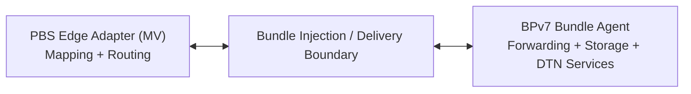

# PBS Edge Adapter — Architecture & Message Flows  
**Document ID:** PBS-EDGE-ARCHITECTURE  
**Status:** Reference Draft  
**Applies To:** PBS-EDGE-ADAPTER-MV  

---

## 1. Purpose

This document describes the reference architecture and message flows for the **PBS Edge Adapter (MV)**, including its placement between PBS envelope producers/consumers and a **BPv7 bundle agent**.

---

## 2. Reference Placement in a DTN Stack

The PBS Edge Adapter occupies a boundary position between:

- PBS-native systems that emit or receive PBS envelopes, and
- DTN systems that forward data using BPv7.

---

## 3. Functional Component Model

The MV architecture is composed of a small set of deterministic components.

---

## 4. Message Flow — Outbound (PBS → BPv7)

This flow begins when a PBS producer submits an envelope to the adapter ingress.

### Outbound Transformation Summary

- PBS identifiers are interpreted under the active Authority Context.
- BPv7 Destination and Source EIDs are constructed deterministically.
- PBS payload bytes become the BPv7 Payload Block bytes.

---

## 5. Message Flow — Inbound (BPv7 → PBS)

This flow begins when a BPv7 bundle is delivered from the bundle agent to the adapter.

### Inbound Transformation Summary

- BPv7 Source/Destination EIDs are parsed relative to the active Authority Context.
- Payload Block bytes become the PBS payload bytes.
- A PBS envelope is reconstructed and delivered to local consumers.

---

## 6. Configuration as an Architectural Boundary

Configuration defines:

- the active Authority Context,
- the EID construction rules used by the mapping engine,
- routing resolution tables for deterministic next-hop selection,
- ingress/egress interface endpoints.

---

## 7. Integration Boundary with the BPv7 Bundle Agent

The adapter and the bundle agent interact through a clear injection/delivery boundary:

---

## 8. Architecture Outputs

The reference architecture produces:

- Deterministic PBS → BPv7 encapsulation aligned with the mapping appendix
- Deterministic BPv7 → PBS reconstruction aligned with the Authority Context model
- A clear placement model suitable for DTN interoperability review

---
