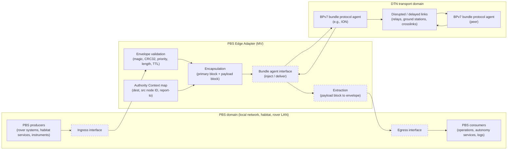
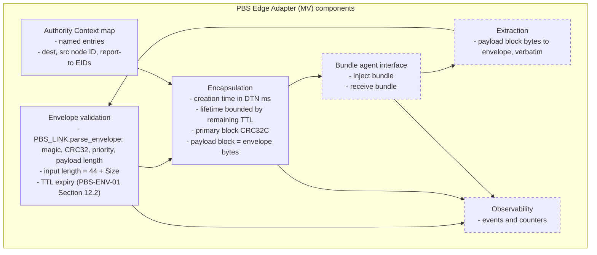
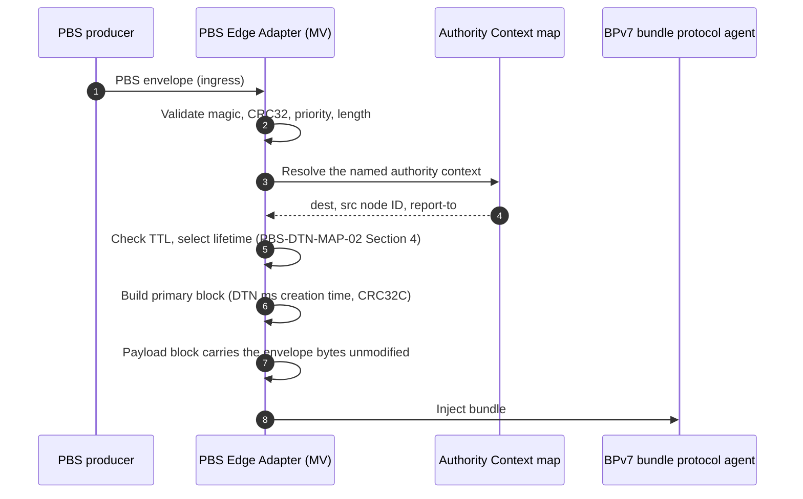
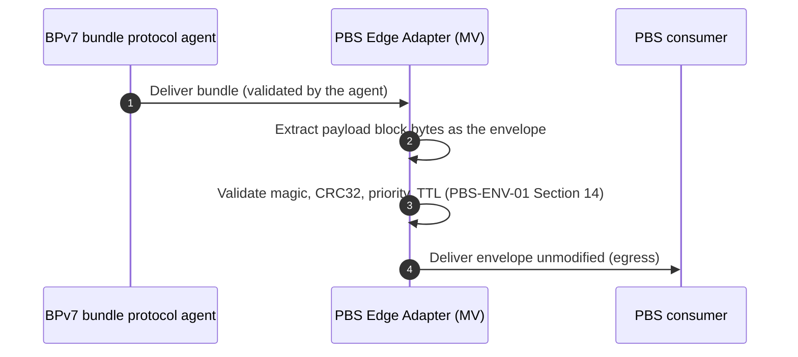
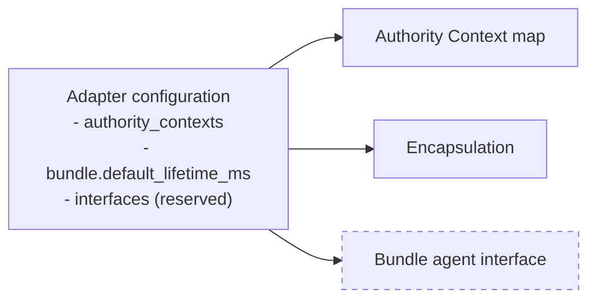
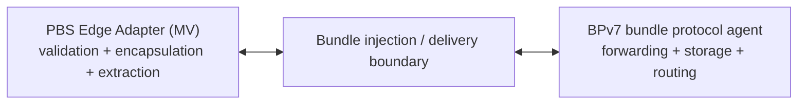

# PBS Edge Adapter — Architecture & Message Flows  
**Document ID:** PBS-EDGE-ARCHITECTURE  
**Status:** Reference Draft  
**Applies To:** PBS-EDGE-ADAPTER-MV  

---

## 1. Purpose

This document describes the reference architecture and message flows of the **PBS Edge Adapter (MV)**: its placement between PBS envelope producers and consumers and a BPv7 bundle protocol agent, its components, and the outbound and inbound flows.

In the diagrams, solid outlines mark components that `pbs_edge_adapter_worked_example.py` implements. Dashed outlines mark specified components that are not implemented.

---

## 2. Placement in a DTN Stack

The adapter sits between PBS-native systems, which emit and receive PBS-ENV-01 v1.3 envelopes, and a bundle protocol agent, which forwards BPv7 bundles. Routing, contact plans and convergence-layer selection remain in the agent (PBS-DTN-MAP-02 Section 8).

---

## 3. Functional Component Model

| Component | Implementation in the worked example |
|-----------|--------------------------------------|
| Envelope validation | `PBS_LINK.parse_envelope`, the length check and `bundle_lifetime_ms` |
| Authority Context map | `AuthorityContextMap` |
| Encapsulation | `pbs_to_bpv7_bundle_mv`, `build_bpv7_bundle` |
| Extraction, bundle agent interface, observability | Not implemented |

---

## 4. Message Flow — Outbound (PBS to BPv7)

The flow begins when a PBS producer submits an envelope to the adapter ingress. Steps 2 to 7 are implemented in the worked example.

### Outbound Transformation Summary

- The Authority Context map supplies the destination EID, source node ID and report-to EID. No envelope field enters an EID.
- The bundle lifetime is the configured default for TTL 0 and min(default, remaining TTL) otherwise.
- The complete envelope, 44-byte header and payload, becomes the payload block data.

---

## 5. Message Flow — Inbound (BPv7 to PBS)

The flow begins when the bundle protocol agent delivers a bundle to the adapter. The worked example does not implement it.

### Inbound Transformation Summary

- The bundle protocol agent validates the bundle before PBS processing (PBS-DTN-MAP-01 Section 7.1).
- The payload block bytes are the original envelope, extracted verbatim (PBS-DTN-MAP-01 Section 7.2).
- No envelope field is derived from bundle EIDs.

---

## 6. Configuration as an Architectural Boundary

Configuration defines the Authority Context map, the default bundle lifetime, and (in a later revision) the interface bindings. [PBS-EDGE-CONFIG-SCHEMA](PBS-EDGE-CONFIG-SCHEMA.md) specifies it.

---

## 7. Integration Boundary with the Bundle Protocol Agent

The adapter and the bundle protocol agent interact only through bundle injection and delivery. The agent provides forwarding, storage, routing and other DTN services.

---

## 8. Architecture Outputs

- PBS to BPv7 encapsulation per [PBS-BPv7-MAPPING-APPENDIX](PBS-BPv7-MAPPING-APPENDIX.md), implemented and tested in the worked example.
- BPv7 to PBS extraction per PBS-DTN-MAP-01 Section 7, specified and not implemented.
- A placement model for DTN interoperability review.
