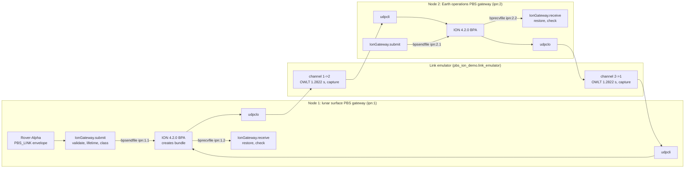

# PBS-ION-E2E-DEMO: PBS Envelopes over NASA/JPL ION, End to End

This document describes a reproducible end-to-end demonstration. PBS-ENV-01 envelopes cross a delay/disruption-tolerant network of two NASA/JPL Interplanetary Overlay Network (ION) nodes. The nodes are joined by an emulated Earth–Moon link with the one-way light time of the Moon's mean distance. The demonstration uses upstream ION, release `ion-open-source-4.2.0`, built unmodified from the NASA/JPL repository. It uses ION's own programs to submit and deliver bundles. Every claim it makes is checked on observed data: bytes ION delivered, bundles captured on the link, and ION's own statistics and log.

The worked example (`pbs_edge_adapter_worked_example.py`) builds bundle bytes and connects to no bundle protocol agent. This demonstration adds the bundle protocol agent, as PBS-DTN-MAP-01 Section 6.1 specifies for a gateway: ION creates each bundle and assigns its creation timestamp.

| Document | Content |
|----------|---------|
| This document | Purpose, architecture, how to run it, what it shows |
| [PBS-ION-MAPPING-PROFILE.md](PBS-ION-MAPPING-PROFILE.md) | The mapping profile and no-expiry lifetime record that PBS-DTN-MAP-01 §6.1.1 and §6.3 and PBS-DTN-MAP-02 §4 and §5 require, for ION 4.2.0 |
| [PBS-ION-E2E-TEST-PLAN.md](PBS-ION-E2E-TEST-PLAN.md) | Requirements, traceability matrix, test cases, procedures, records |

---

## 1. Background

The Bundle Protocol carries data across networks where no end-to-end path need exist at any one time. Nodes store bundles and forward them as contacts become available [RFC 4838; S2]. BPv7 is specified in RFC 9171. LunaNet Interoperability Specification V005 Section 3.1.2 requires BPv7 for DTN network communications services.

ION is NASA/JPL's implementation of the Bundle Protocol and its supporting protocols, designed for flight and ground use [S1]. DTN was validated in flight in the Deep Impact Network Experiment on the EPOXI spacecraft, which used ION [S5], and DTN has been deployed on the International Space Station [S6]. ION schedules transmissions from a contact plan and routes over it with contact graph routing [S3, S4].

PBS carries mission semantics (priority, TTL, header integrity) in a 44-byte envelope header. PBS-DTN-MAP-01 places the whole envelope in one bundle's payload block and leaves the network service to the bundle protocol agent.

## 2. Architecture



| Component | File | Role |
|-----------|------|------|
| ION 4.2.0 | built by `scripts/build_ion.sh` | Bundle protocol agent on each node: creates, stores, schedules, forwards, delivers and expires bundles |
| `IonNetwork`, `IonNode` | `pbs_ion_demo/ion_node.py` | Write each node's `ionconfig`, `ionrc`, `ionsecrc`, `bprc` and `ipnrc`; start and stop nodes with `ionadmin`, `ionsecadmin`, `bpadmin` and `ipnadmin`; read `bpstats` tallies |
| `IonGateway` | `pbs_ion_demo/ion_gateway.py` | PBS gateway: validates the envelope, selects lifetime and class of service, submits with `bpsendfile`, collects deliveries from `bprecvfile`, restores and checks the envelope |
| `LinkEmulator` | `pbs_ion_demo/link_emulator.py` | Delays every UDP datagram by the OWLT and records it |
| `decode_bundle` | `pbs_ion_demo/bpv7_wire.py` | Independent BPv7 decoder: checks every block CRC over the bytes as received |
| `LunarEarthNetwork` | `pbs_ion_demo/scenario.py` | Assembles the two nodes, the link and a contact plan |

Design choices:

- **Upstream ION, unmodified.** The build script clones the release tag and stops if it does not resolve to the pinned commit. The gateway uses ION's distributed programs (`bpsendfile`, `bprecvfile`, `bpstats`) and links no code into ION.
- **UDP convergence layer.** ION sends each bundle in one UDP datagram with no further framing (`bpv7/udp/libudpcla.c`), so every datagram the emulator captures is a complete serialized bundle that can be decoded and checked.
- **Contact plan, not packet loss, models disruption.** As in operational ION, the sending node transmits only during planned contacts. The emulator adds delay and records traffic. The capture shows when ION transmitted.
- **Two nodes on one host.** Each node has its own directory, SDR, and shared-memory keys (`wmKey`, `sdrWmKey`, `heapKey`, `logKey`), with `ION_NODE_LIST_DIR` set, as in ION's own multi-node tests. The harness picks keys that no existing segment uses. When a node stops, the harness removes that node's segments and ends any of its processes still running. It never runs `killm`, which would stop every ION process on the host. Test IT-13 checks that a stopped network leaves nothing behind.

## 3. What the demonstration shows

`python -m pbs_ion_demo` runs four steps and prints a PASS/FAIL line for each check:

1. **Downlink.** A NORMAL rover telemetry envelope (TTL 120 s) goes from node 1 to node 2. ION delivers it byte-identical, and PBS_LINK verifies its header CRC32. The captured bundle is printed: source `ipn:1.1`, destination `ipn:2.2`, ION's extension blocks (previous node 6, bundle age 7, ION QoS 193) and the payload block. The bundle expires about 3 s before the envelope, the 2 s submission-latency bound plus rounding to whole seconds. It spends 1.2822 s on the link.
2. **Uplink.** A CRITICAL command envelope goes from node 2 to node 1 and travels as ION class 2 (expedited), per the PBS-DTN-MAP-01 §6.3 table.
3. **Interoperability.** A bundle encoded by the worked example is sent to node 2. ION accepts it and delivers the envelope.
4. **Contact gap.** No contact is planned for 15 s. Two envelopes are submitted at once. ION keeps the TTL 120 s envelope and transmits it after the contact opens. The TTL 6 s envelope's lifetime ends in storage, ION deletes it (`exp` tally 1), and it is never transmitted.

Example output (abridged; times and creation values differ from run to run):

```
ION ION-OPEN-SOURCE-4.2.0 (ion-open-source-4.2.0 568df887cb9f) from .ion/install/bin
Nodes up: ipn:1 (lunar) and ipn:2 (Earth); one-way light time 1.2822 s

=== 1. Downlink: rover telemetry, lunar gateway -> Earth gateway ===
  bpsendfile ipn:1.1 -> ipn:2.2: lifetime 117 s, ION class 1
  [PASS] delivered byte-identical, header CRC32 verified
  on the wire: ipn:1.1 -> ipn:2.2, flags 0x40, created 844661132527 ms DTN time (seq 0),
               lifetime 117000 ms, blocks [type 6, type 193, type 7, type 1], ION class 1, 153 bytes
  [PASS] bundle CRCs verify, no reserved flag
  [PASS] bundle expires no later than the envelope: margin 2995 ms
  [PASS] held on the link for one OWLT: 1.2825 s
...
=== 4. Contact gap: no contact for 15 s ===
  [PASS] held envelope crossed the link only after the contact opened: 1.580 s after
  [PASS] held envelope delivered byte-identical
  [PASS] short-lived envelope expired in storage, never sent: node 1 tallies {... 'exp': 1}

10 of 10 checks passed. Report: ion-demo-runs/<UTC>/report.json
```

The run directory keeps each node's generated ION configuration, `ion.log`, spooled and delivered envelopes, and `report.json`.

## 4. How to run

Requirements: Linux x86-64, Python 3.10 or later, git, a C compiler, make, autoconf, automake and libtool (Debian/Ubuntu: `sudo apt-get install build-essential autoconf automake libtool`).

```bash
# 1. Build the pinned ION release (several minutes; skipped if already built)
scripts/build_ion.sh                      # installs into .ion/install
export ION_PREFIX="$PWD/.ion/install"

# 2. Python dependencies, pinned
python -m venv .venv && . .venv/bin/activate
python -m pip install -r requirements-ion-demo.txt

# 3. Demonstration
python -m pbs_ion_demo

# 4. Verification: all unit tests and the ION end-to-end tests (about 90 s)
PBS_ION_REQUIRED=1 pytest -v
```

Without `ION_PREFIX`, the ION tests are skipped and the unit tests still run. `PBS_ION_REQUIRED=1` turns a skip into a failure. Test records are written to `ion-test-results/` (Test Plan §7).

## 5. Gateway behavior in brief

[PBS-ION-MAPPING-PROFILE.md](PBS-ION-MAPPING-PROFILE.md) states these rules in full with their ION source references.

- **Validation.** PBS_LINK `parse_envelope` (magic, header CRC32, priority, length), and the worked example's one-envelope length check.
- **Lifetime.** ION assigns the creation time after the gateway has chosen the lifetime. The gateway therefore evaluates the PBS-DTN-MAP-01 §6.1 bound at `c_us` = its clock reading + 2 s, which §6.1 explicitly allows, and checks afterwards that `bpsendfile` finished within those 2 s. ION's `bp_send()` takes whole seconds, so the gateway rounds down. An envelope with less than 1 s left is refused.
- **No-expiry lifetime** (TTL 0): 2 147 483 647 s, the largest value ION's `bp_send()` accepts.
- **Class of service.** CRITICAL and HIGH map to expedited (2), NORMAL to standard (1), LOW and BULK to bulk (0). ION carries the class in its QoS extension block (type 193) and in no bundle processing control flag.
- **Acceptance.** A submission counts only when ION logs `bpsendfile sent '<file>'`.
- **Inbound.** The delivered payload must be one valid envelope that has not expired (age ≤ TTL, time in the network included). It is returned unmodified.

## 6. Limitations

The demonstration runs one host, two nodes, the UDP convergence layer, no BPSec, custody transfer or fragmentation, and single-hop routing. Bundles are limited to 65 507 bytes by IPv4 UDP; ION's UDP convergence layer refuses more than 65 535. Its results describe this configuration and do not qualify ION or the gateway for flight use. Test Plan §8 gives the complete list.

## 7. References

- RFC 9171, *Bundle Protocol Version 7*, 2022. <https://www.rfc-editor.org/rfc/rfc9171>
- RFC 4838, *Delay-Tolerant Networking Architecture*, 2007. <https://www.rfc-editor.org/rfc/rfc4838>
- RFC 9758, *Updates to the 'ipn' URI Scheme*, 2025. <https://www.rfc-editor.org/rfc/rfc9758>
- LunaNet Interoperability Specification, Version 5 (NASA, ESA, JAXA, 29 January 2025). <https://www.nasa.gov/wp-content/uploads/2025/02/lunanet-interoperability-specification-v5-baseline.pdf>
- CCSDS 734.20-O-1, Orange Book (Experimental Specification), April 2025, which presents itself as a CCSDS profile of RFC 9171. <https://ccsds.org/wp-content/uploads/gravity_forms/5-448e85c647331d9cbaf66c096458bdd5/2025/06/734x20o1.pdf>
- NASA/JPL, ION-DTN, release ion-open-source-4.2.0. <https://github.com/nasa-jpl/ION-DTN/tree/ion-open-source-4.2.0>
- NASA NSSDCA, *Moon Fact Sheet*. <https://nssdc.gsfc.nasa.gov/planetary/factsheet/moonfact.html>
- [S1] S. Burleigh, "Interplanetary Overlay Network: An Implementation of the DTN Bundle Protocol," IEEE CCNC 2007, pp. 222–226. doi:[10.1109/CCNC.2007.51](https://doi.org/10.1109/CCNC.2007.51)
- [S2] S. Burleigh et al., "Delay-tolerant networking: an approach to interplanetary Internet," *IEEE Communications Magazine* 41(6):128–136, 2003. doi:[10.1109/MCOM.2003.1204759](https://doi.org/10.1109/MCOM.2003.1204759)
- [S3] G. Araniti et al., "Contact graph routing in DTN space networks: overview, enhancements and performance," *IEEE Communications Magazine* 53(3):38–46, 2015. doi:[10.1109/MCOM.2015.7060480](https://doi.org/10.1109/MCOM.2015.7060480)
- [S4] J. A. Fraire, O. De Jonckère, S. C. Burleigh, "Routing in the Space Internet: A contact graph routing tutorial," *Journal of Network and Computer Applications* 174:102884, 2021. doi:[10.1016/j.jnca.2020.102884](https://doi.org/10.1016/j.jnca.2020.102884)
- [S5] J. Wyatt et al., "Disruption Tolerant Networking Flight Validation Experiment on NASA's EPOXI Mission," SPACOMM 2009, pp. 187–196. doi:[10.1109/SPACOMM.2009.39](https://doi.org/10.1109/SPACOMM.2009.39)
- [S6] A. Schlesinger et al., "Delay/Disruption Tolerant Networking for the International Space Station (ISS)," 2017 IEEE Aerospace Conference. doi:[10.1109/AERO.2017.7943857](https://doi.org/10.1109/AERO.2017.7943857)
- PBS specifications: PBS-ENV-01, PBS-DTN-MAP-01, PBS-DTN-MAP-02 (v1.5). <https://github.com/Pale-Blue-Systems/PBS-PROTOCOL-OPEN/tree/main/PBS-RFC-LIB>
